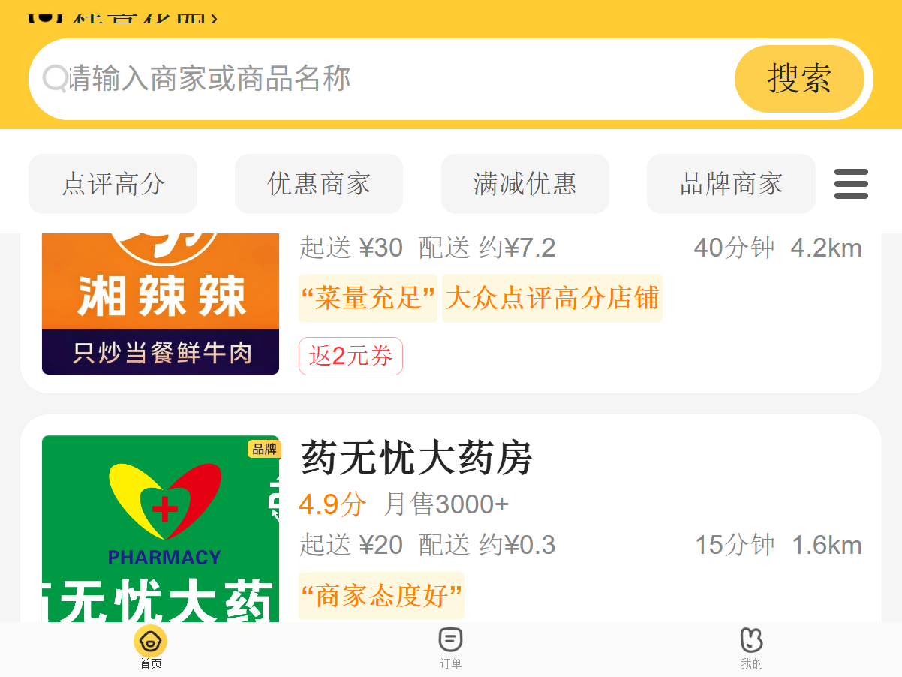

# 🎫 美团外卖自动领券 Skill

[](LICENSE)
[](https://catpaw.meituan.com/)
[](https://i.waimai.meituan.com/)
[](skills/meituan-coupon/SKILL.md)

> 一个基于浏览器自动化的美团外卖商家优惠券自动领取工具，运行在 [CatPaw](https://catpaw.meituan.com/) 平台，通过 H5 移动版页面完成领券全流程。



## 📑 目录

- [功能特点](#-功能特点)
- [工作原理](#-工作原理)
- [使用前提](#-使用前提)
- [安装](#-安装)
- [触发方式](#-触发方式)
- [技术细节](#-技术细节)
- [常见问题](#-常见问题)
- [风险提示](#️-风险提示)
- [License](#-license)

## ✨ 功能特点

- 🔐 **短信验证码登录** — 无需输入密码，安全性更高
- 💾 **登录态保存** — 一次登录，后续免登录直接使用
- 🔍 **自动检测** — 智能扫描商家列表中的券标签（`领X元券` / `返X元券` / `新客减X`）
- 🎯 **精准定位** — 深入商家详情页，自动点击 `¥X领` 券按钮
- 🛡️ **异常处理** — 自动处理弹窗遮挡、登录态失效等场景
- 📊 **结果汇总** — 领取完成后输出清晰的成败清单

## 🧠 工作原理

```
H5 登录（短信验证码）
        │
        ▼
保存登录态 JSON（本地）
        │
        ▼
进入 H5 商家列表（i.waimai.meituan.com/waimai/mindex/home）
        │
        ▼
扫描券标签（.d_lb：领2元券 / 领3元券 / 返2元券）
        │
        ▼
点击商家卡片 → 进入商家详情页
        │
        ▼
点击领券按钮（span.root_l0nL51：¥1领 / ¥2领 / ¥3领）
        │
        ▼
输出领取结果报告
```

> 💡 **为什么用 H5 而不是 PC 网页版？**
> 美团桌面网页版（`waimai.meituan.com/coupon/`）不提供领券中心入口，访问会被重定向到 APP 下载页。券功能主要集成在移动端 H5 页面中，本 skill 因此选择 H5 作为操作入口。

## 📋 使用前提

- 已安装 [CatPaw](https://catpaw.meituan.com/) 客户端（内置 `paw browser-action` 浏览器自动化）
- 拥有美团账号，可接收短信验证码

## 📦 安装

将本仓库克隆到 CatPaw 的 skills 目录：

```bash
# Windows（个人 skills 目录，全项目可用）
git clone https://github.com/csjad/maituan_skill.git "%USERPROFILE%\.meituan-catpaw\3192536222\skills\meituan-coupon"
```

或手动下载 `skills/meituan-coupon/SKILL.md` 放入对应目录。

## 💬 触发方式

在 CatPaw 对话中直接说：

- 「帮我领美团外卖的券」
- 「自动领券」
- 「领取美团优惠券」
- 「美团外卖优惠券」

首次使用会引导你完成短信验证码登录；之后登录态保存在本地，可直接使用。

## 🔧 技术细节

| 项目 | 说明 |
|------|------|
| 自动化引擎 | CatPaw 内置 `paw browser-action`（Chromium） |
| 目标站点 | 美团外卖 H5（`i.waimai.meituan.com`） |
| 登录方式 | 短信验证码 |
| 登录态存储 | 本地 JSON（`state_save` / `state_load`） |
| 元素定位 | CSS Selector + JavaScript `evaluate` |

### 关键元素速查表

| 位置 | 元素 | 定位方式 |
|------|------|----------|
| 商家列表 | 券标签 | `.d_lb`（文本含 `领X元券`） |
| 商家列表 | 可点击卡片 | `[onclick]` 父容器 |
| 商家详情 | 领券按钮 | `span.root_l0nL51`（文本 `¥X领`） |
| 商家详情 | 收藏并领取 | `.receive_DP9lDs` |
| 全站 | 弹窗遮挡层 | `.modalShadow`（需先隐藏） |

> ⚠️ CSS 类名（如 `root_l0nL51`）为构建产物哈希，美团前端发版后可能变化，届时需重新抓取快照更新选择器。

## ❓ 常见问题

**Q: 登录态多久失效一次？**
A: 取决于美团服务端会话策略，一般数天到数周。失效后重新走一次短信登录即可。

**Q: 领券没有反应怎么办？**
A: 部分券为「下单返券」类型（`返X元券`），需实际下单后才到账；`领X元券` 类型点击后通常静默到账，可到「我的」→ 红包页核对。

**Q: 会被美团封号吗？**
A: 正常频率的个人使用风险较低，但高频自动化操作可能触发风控。建议手动触发、适度使用。

## ⚠️ 风险提示

- 本项目仅供**学习研究**和**个人使用**，请遵守美团平台用户协议
- 请勿用于任何商业用途或批量薅羊毛场景
- 页面结构更新可能导致脚本失效，issue 反馈即可
- 使用本项目产生的任何账号风险由使用者自行承担

## 🤝 贡献

欢迎 PR！包括但不限于：适配新的券类型、修复选择器、增加多城市支持。

## 📄 License

[MIT](LICENSE) © 2026 csjad
